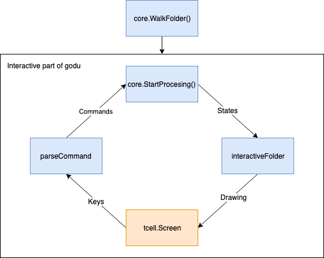

# Contribution guide
So you decided to help godu out hey? Perfect. Thank you already even for entertaining the idea.

## Setting up the project
Why for nomral use it is ok to call `go get` without go modules, if you are going to make changes to the codebase, please make sure you have Go 1.11 or later intalled and you have got Go modules enabled (`GO111MODULE=on`) [Extensive Info](https://github.com/golang/go/wiki/Modules)

## Godu architecture


Main things to consider when implementing new functionality is packages, there are 3:
* `core` - this is the true godu. Everything that does the main job is here. If godu wasn't CLI utility but GUI app, this package would ideally stay untouched
* `interactive` - this is functionality connected to UI of the app
* `main` - this contains main wiring + tcell.Screen related functionality, **this is the only package that is not expected to have 100% test coverage**

#### Before doing significant changes to core (specially changing the main structures like File and State, please consult the change in form of Github Issue

## Main ideas
### State is immutable
- Except for `folder *File` property the state should be immutable. I would make `folder` immutable as well but that would mean referencing it as a value and potentially copying 200M of memory every user interaction
- Please make sure that you are never using pointers(and arrays) from `oldState` when creating `newState` in a `Executer` (a.k.a. command)

### the root folder structure should only represent the file system
You would notice that in `godu.go` we are walking through the whole folder using
```
rootFolder := core.WalkFolder(rootFolderName, ioutil.ReadDir, getIgnoredFolders())
```
The expectation is that the `core.File` structure contains only representation of the file system and it is not going to change after calling `WalkFolder`

### Everything that commands do should be represented in State
When implementing new command please make sure that it's result is captured in a state and that the state is appropriately displayed using `InteractiveFolder` (e.g. highlighting selected line in file column)

## 100% test coverage
Expectation is that `core` and `interactive` packages will have 100% test coverage. I'm not a testing nazi but I won't have time to checkout every PR and manually retest it and neither will you. We need to be confident that `godu` still works after merging your (and any subsequent) PR.
